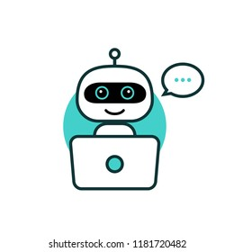

# Chatty-bot



This repo provides an implementation of Chatty-Bot, a chat bot trained with Pytorch using a sequence to sequence model. The Encode-Decoder uses Luong attention mechanism  as per paper [here](https://arxiv.org/abs/1508.04025).

The dataset chosen is the [Cornell Movie-Dialogs Corpus](https://www.cs.cornell.edu/~cristian/Cornell_Movie-Dialogs_Corpus.html).

This project is a variation of the Pytorch tutorial [here](https://pytorch.org/tutorials/beginner/chatbot_tutorial.html).

The major difference from the tutorial is the use of pre-trained embedding. You can download the pretrained GloVe embedding from [here](https://nlp.stanford.edu/projects/glove/) and download:

1. Wikipedia 2014 + Gigaword 5 (6B tokens, 400K vocab, uncased, 50d, 100d, 200d, & 300d vectors, 822 MB download): glove.6B.zip

# Train
To train the model run:

```
python -u main.py 
```
The model runs the Pytorch [Distributed Data Parallel](https://pytorch.org/docs/master/generated/torch.nn.parallel.DistributedDataParallel.html) so it can be run on multiple GPUs

Below the available arguments:
```
-n --nodes - number of gpus per node
```
```
-nr --nr - ranking within the nodes
```
```
--epochs - If set, number of epochs to train the model. Default=100
```
```
--batch_size - batch size to train the model. Default=32
```
```
--pre_trained - If set, load pre-trained model
```
```
--toy' - If set, use small data; used for fast debugging
```
```
--dot - If set, apply dot attention
```
```
--general - If set, apply general attention
```
```
--concat - If set, apply concatenation attention
```
```
--sgd - If set, apply SGD optimizer
```
```
--plot - If set, show plots
```
```
--trainable - If set, uses trainable embeddings
```

# Docker

The model can also be run with Docker. Below code to run it:

```
docker build --no-cache -t my_torch .

docker run --name=seq2seq --gpus all -v my_vol:/src my_torch python3 -u main.py --epochs 1000 --batch_size 64 --concat --trainable --gpus 8
```

If you want to plot model performance during training yot need to run (if on AWS make sure to use Putty and x11 connection) for example:

```
docker run --net=host --env="DISPLAY" --volume="$HOME/.Xauthority:/root/.Xauthority:rw" --name=seq2seq --gpus all -v my_vol:/src my_torch python3 -u main.py --epochs 1000 --batch_size 64 --concat --trainable --gpus 8 --plot
```
To save results in folder after done training use:
```
docker cp seq2seq:/src/saved_model ./
```
# Run Chat-Bot

When the model is trained you need to move into the *app* folder and run:

```
python app.py
```
Go to your browser at localhost url (*http://127.0.0.1:5000/*) and enjoy chatting with the Bot!!!!
